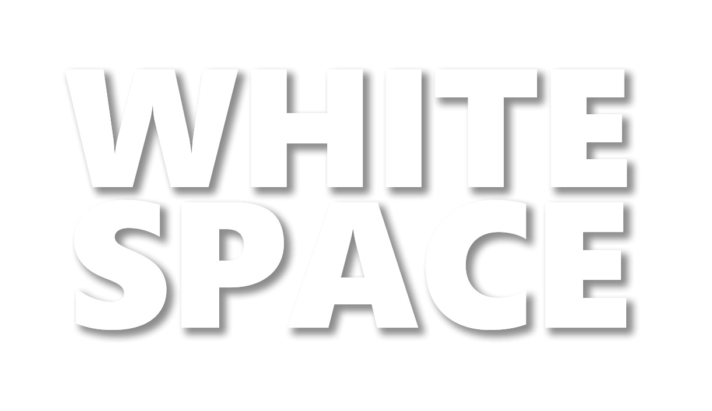
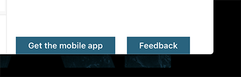

## Whitepace - Regain distraction-free working in SharePoint 

This application customiser removes "Mobile App" and "Teams" information from any Team and communication iste in SharePoint.



### ⚠️ Disclaimer ⚠️

This solution uses CSS injection on modern experience pages and hide elements from Communication and Teamsite. The CSS provided by this solution are served via this GitHub page and will be directly injected from the web using the following URL: https://n8design.github.io/whitespace/blacklist.css

This demo extension should not be used under any circumstances in any production environment. It you still use it it is at your own risk.

### Elements remove by this solution

#### Teams Notification


#### Mobile App Notification



#### Mobile App Secondary Footer


### Download this solution

To downloade this solution please check out the the [release page](https://github.com/n8design/whitespace/releases).

### Installation

To install this solution please follow [this instructions](https://docs.microsoft.com/en-us/sharepoint/dev/spfx/web-parts/get-started/serve-your-web-part-in-a-sharepoint-page#deploy-the-helloworld-package-to-app-catalog).

### Configuration

This solution also allows to modify the default location the CSS is servers from. To modify this setting navigate to tenant wide app catalog and to the tenant wide extension list.


Edit the entry 'N8DWhiteSpaceApplicationCustomizer'


```js
{
  "CSSOverrideUrl":"https://n8design.github.io/whitespace/blacklist.css"
}
```

Modify the CSSOverrideUrl property and save the entry.


